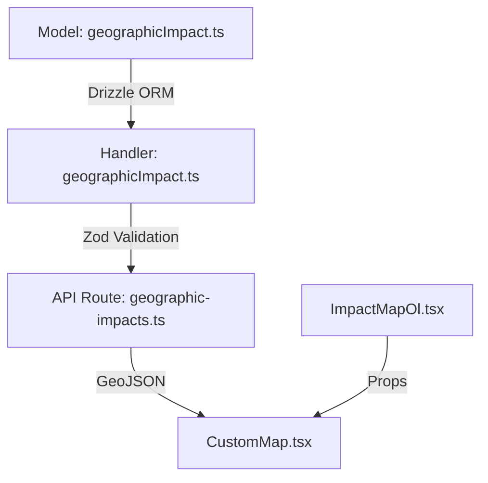

# CustomMap Integration Guide

##  Quick Start

### Required Dependencies

Before using CustomMap, ensure you have these dependencies in your project:

1. **Core Dependencies**
```typescript
// Required components and utilities
import Legend from "~/frontend/analytics/sectors/sections/Map/Legend";
import { formatCurrencyWithCode, useDefaultCurrency } from "~/frontend/utils/formatters";
import "~/frontend/analytics/sectors/sections/Map/ImpactMap.css";
```

2. **Styling Setup**
Create a copy of the required CSS file in your project:
```css
/* ImpactMap.css */
.map-container {
  position: relative;
  width: 100%;
  height: 500px;
}

.ol-map {
  width: 100%;
  height: 100%;
}

/* ... copy other required styles ... */
```

3. **Currency Formatting**
Ensure your formatters utility is set up:
```typescript
// formatters.ts
export function formatCurrencyWithCode(value: number, code = "USD"): string {
  return new Intl.NumberFormat("en-US", {
    style: "currency",
    currency: code,
  }).format(value);
}

export function useDefaultCurrency() {
  // Your currency hook implementation
  return "USD"; // or your default currency
}
```

4. **Legend Component**
Create a basic Legend component if you don't have one:
```typescript
// Legend.tsx
import React from "react";

interface LegendProps {
  ranges: Array<{
    min: number;
    max: number;
    color: string;
    label: string;
  }>;
  title?: string;
}

export default function Legend({ ranges, title }: LegendProps) {
  return (
    <div className="map-legend">
      {title && <h4>{title}</h4>}
      {ranges.map((range, i) => (
        <div key={i} className="legend-item">
          <span 
            className="color-box" 
            style={{ backgroundColor: range.color }} 
          />
          <span>{range.label}</span>
        </div>
      ))}
    </div>
  );
}
```

### 1. Data Helper Function
Copy this helper to easily transform your data:

```typescript
function prepareMapData(data: any[], options = { 
  valueKey: 'value',
  geometryKey: 'geometry',
  idKey: 'id',
  nameKey: 'name'
}) {
  return {
    type: "FeatureCollection",
    features: data.map(item => ({
      type: "Feature",
      geometry: item[options.geometryKey],
      properties: {
        id: item[options.idKey],
        name: item[options.nameKey],
        level: 1,
        parentId: null,
        values: {
          totalDamage: item[options.valueKey] || 0,
          totalLoss: 0,
          dataAvailability: item[options.valueKey] ? 'available' : 'no_data'
        }
      }
    }))
  };
}
```

### 2. Use the Map

```typescript
import CustomMap from "~/components/CustomMap";

function YourComponent({ data }) {
  // Transform your data
  const geoData = prepareMapData(data, {
    valueKey: 'damage', // change this to match your data structure
    geometryKey: 'geojson',
    idKey: 'locationId',
    nameKey: 'locationName'
  });

  // Render the map
  return (
    <CustomMap
      geoData={geoData}
      selectedMetric="totalDamage"  // or "totalLoss"
      filters={{}}  // Optional filters
      levelCap={1}  // Max geographic level to show
    />
  );
}
```

That's it! The map will render with default styling and interactions.

##  Architecture Overview

The CustomMap component is part of a Clean Architecture implementation following Domain-Driven Design principles. Here's how data flows through the system:



### 1. Data Flow Layers

#### Model Layer (`backend.server/models/geographicImpact.ts`)
```typescript
// Domain logic for geographic impact data
export interface GeographicImpactFilters {
  sectorId?: string;
  subSectorId?: string;
  hazardTypeId?: string;
  hazardClusterId?: string;
  specificHazardId?: string;
  geographicLevelId?: string;
  fromDate?: string;
  toDate?: string;
  // ... other filters
}

export async function getGeographicImpact(filters: GeographicImpactFilters) {
  // Returns { divisions, values } following UNDRR standards
}
```

#### Handler Layer (`backend.server/handlers/geographicImpact.ts`)
```typescript
// Use-case logic with input validation
const GeographicImpactQuerySchema = z.object({
  sectorId: z.string().optional(),
  subSectorId: z.string().optional(),
  hazardTypeId: z.string().optional(),
  hazardClusterId: z.string().optional(),
  specificHazardId: z.string().optional(),
  geographicLevelId: z.string().optional(),
  // ... other validations
});

export async function handleGeographicImpactQuery(params: unknown) {
  const validParams = GeographicImpactQuerySchema.parse(params);
  return await getGeographicImpact(validParams);
}
```

#### API Route (`routes/api+/geographic-impacts.ts`)
```typescript
// Remix loader that exposes the API
export const loader = async ({ request }: { request: Request }) => {
  const url = new URL(request.url);
  const params = Object.fromEntries(url.searchParams);
  const result = await handleGeographicImpactQuery(params);
  
  return Response.json({
    type: "FeatureCollection",
    features: result.divisions.map(/* transform to GeoJSON */)
  });
};
```

### 2. Integration Patterns

#### Pattern 1: Full Stack Integration
Use this when you need filters and API integration:

```typescript
import CustomMap from "~/components/CustomMap";

// Create a thin wrapper component
export function MyMapComponent({ filters }) {
  const { data: geoData } = useQuery({
    queryKey: ["geographic-impacts", filters],
    queryFn: () => fetchFromApi("/api/analytics/geographic-impacts", filters)
  });

  return (
    <ErrorBoundary>
      <CustomMap
        geoData={geoData}
        selectedMetric="totalDamage"
        filters={filters}
        apiEndpoint="/api/analytics/geographic-impacts"
        levelCap={3}
      />
    </ErrorBoundary>
  );
}
```

#### Pattern 2: Direct Model Integration
Use this when working directly with the model:

```typescript
import { getGeographicImpact } from "~/backend.server/models/geographicImpact";

// In your Remix loader
export async function loader() {
  const result = await getGeographicImpact({});
  return Response.json({ geoData: transformToGeoJSON(result) });
}

// In your component
export function DirectMapComponent() {
  const { geoData } = useLoaderData<typeof loader>();
  return (
    <CustomMap
      geoData={geoData}
      selectedMetric="totalDamage"
      filters={{}}
      levelCap={1}
    />
  );
}
```

#### Pattern 3: Static Data Integration
Use this for pre-computed or static data:

```typescript
export function StaticMapComponent({ staticGeoData }) {
  return (
    <CustomMap
      geoData={transformToGeoJSON(staticGeoData)}
      selectedMetric="totalDamage"
      filters={{}}
      levelCap={1}
    />
  );
}
```

#### Pattern 4: Full Integration with Currency and Legend

```typescript
import CustomMap from "~/components/CustomMap";
import { formatCurrencyWithCode, useDefaultCurrency } from "~/frontend/utils/formatters";
import "~/frontend/analytics/sectors/sections/Map/ImpactMap.css";

export function FullFeaturedMap({ geoData }) {
  const defaultCurrency = useDefaultCurrency();
  
  const formatValue = (value: number) => 
    formatCurrencyWithCode(value, defaultCurrency);
  
  return (
    <div className="map-container">
      <CustomMap
        geoData={geoData}
        selectedMetric="totalDamage"
        formatValue={formatValue}
        calculateColorRanges={(values) => [
          { min: 0, max: 1000000, color: "#e5f5e0", label: formatValue(1000000) },
          { min: 1000000, max: Infinity, color: "#208f04", label: "> " + formatValue(1000000) }
        ]}
      />
    </div>
  );
}
```

#### Pattern 5: Custom Legend Integration

```typescript
function MapWithCustomLegend({ geoData }) {
  const ranges = [
    { min: 0, max: 1000000, color: "#e5f5e0", label: "Low Impact" },
    { min: 1000000, max: 5000000, color: "#74c476", label: "Medium Impact" },
    { min: 5000000, max: Infinity, color: "#208f04", label: "High Impact" }
  ];

  return (
    <div className="map-container">
      <CustomMap
        geoData={geoData}
        selectedMetric="totalDamage"
        calculateColorRanges={() => ranges}
      />
      <Legend 
        ranges={ranges}
        title="Impact Levels"
      />
    </div>
  );
}
```

### 3. Best Practices

1. **Error Handling**
```typescript
<ErrorBoundary fallback={<MapErrorState />}>
  <CustomMap
    geoData={geoData}
    onError={(error) => {
      console.error("Map error:", error);
      notifyError(error);
    }}
    {...otherProps}
  />
</ErrorBoundary>
```

2. **Loading States**
```typescript
function MapWithLoading() {
  const { data, isLoading } = useQuery({/*...*/});
  
  if (isLoading) {
    return <MapLoadingState />;
  }
  
  return <CustomMap geoData={data} {...otherProps} />;
}
```

3. **Data Validation**
```typescript
const GeoDataSchema = z.object({
  type: z.literal("FeatureCollection"),
  features: z.array(/* ... */)
});

function ValidatedMap({ data }) {
  const validData = useMemo(() => {
    try {
      return GeoDataSchema.parse(data);
    } catch (e) {
      console.error("Invalid GeoData:", e);
      return null;
    }
  }, [data]);
  
  if (!validData) return <InvalidDataState />;
  
  return <CustomMap geoData={validData} {...otherProps} />;
}
```

4. **Performance Optimization**
```typescript
function OptimizedMap({ geoData, filters }) {
  // Memoize expensive transformations
  const transformedData = useMemo(() => 
    transformGeoData(geoData), 
    [geoData]
  );
  
  // Debounce filter changes
  const debouncedFilters = useDebounce(filters, 300);
  
  return (
    <CustomMap
      geoData={transformedData}
      filters={debouncedFilters}
      {...otherProps}
    />
  );
}
```

5. **Currency and Formatting**
```typescript
function MapWithCurrency({ geoData }) {
  const defaultCurrency = useDefaultCurrency();
  
  // Create a memoized formatter
  const formatter = useMemo(() => 
    (value: number) => formatCurrencyWithCode(value, defaultCurrency),
    [defaultCurrency]
  );
  
  return (
    <CustomMap
      geoData={geoData}
      selectedMetric="totalDamage"
      formatValue={formatter}
      {...otherProps}
    />
  );
}
```

6. **Styling Best Practices**
```typescript
// Import the required CSS
import "~/frontend/analytics/sectors/sections/Map/ImpactMap.css";

// Use proper container classes
function StyledMap() {
  return (
    <div className="map-container">
      <div className="ol-map">
        <CustomMap {...props} />
      </div>
      <Legend {...legendProps} />
    </div>
  );
}
```

### 4. TypeScript Integration

```typescript
import type { 
  CustomMapProps,
  GeoData,
  Filters,
  ColorRange
} from "~/components/CustomMap";

// Extend the base props
interface EnhancedMapProps extends Omit<CustomMapProps, 'geoData'> {
  rawData: YourDataType;
  customOptions?: YourOptionsType;
}

// Type-safe component
export function TypeSafeMap(props: EnhancedMapProps) {
  const geoData = useTransformData(props.rawData);
  return <CustomMap {...props} geoData={geoData} />;
}
```

### 5. Testing

```typescript
import { render, screen } from "@testing-library/react";
import { mockGeoData } from "~/test/fixtures";

describe("CustomMap Integration", () => {
  it("renders with valid GeoJSON", () => {
    render(
      <CustomMap
        geoData={mockGeoData}
        selectedMetric="totalDamage"
        filters={{}}
      />
    );
    expect(screen.getByRole("region")).toBeInTheDocument();
  });
}
```

## Common Use Cases

1. **Show both damages and losses:**
```typescript
function prepareFullMapData(data: any[]) {
  return {
    type: "FeatureCollection",
    features: data.map(item => ({
      type: "Feature",
      geometry: item.geometry,
      properties: {
        id: item.id,
        name: item.name,
        level: 1,
        parentId: null,
        values: {
          totalDamage: item.damage || 0,
          totalLoss: item.loss || 0,
          dataAvailability: (item.damage || item.loss) ? 'available' : 'no_data'
        }
      }
    }))
  };
}

// Usage:
const geoData = prepareFullMapData(yourData);
<CustomMap geoData={geoData} selectedMetric="totalDamage" />
```

2. **Custom colors:**
```typescript
<CustomMap
  geoData={geoData}
  selectedMetric="totalDamage"
  calculateColorRanges={(values) => [
    { min: 0, max: 1000000, color: "#e5f5e0", label: "< 1M" },
    { min: 1000000, max: Infinity, color: "#208f04", label: "> 1M" }
  ]}
/>
```

3. **With filters:**
```typescript
<CustomMap
  geoData={geoData}
  selectedMetric="totalDamage"
  filters={{
    sectorId: "123",
    fromDate: "2024-01-01",
    toDate: "2024-12-31"
  }}
/>
```

## Example Data Structure
Your input data can look like this:
```typescript
const data = [
  {
    locationId: 1,
    locationName: "Region A",
    geojson: { type: "Polygon", coordinates: [[...]] },
    damage: 1000000
  },
  // ... more locations
];

// Use it
const geoData = prepareMapData(data, {
  valueKey: 'damage',
  geometryKey: 'geojson',
  idKey: 'locationId',
  nameKey: 'locationName'
});
```

## Need More?
Check the detailed scenarios below for advanced use cases.

## Table of Contents
- [Component Overview](#component-overview)
- [Integration Scenarios](#integration-scenarios)
  - [Scenario 1: Full Flow Integration](#scenario-1-full-flow-integration)
  - [Scenario 2: Alternate Data Model](#scenario-2-alternate-data-model)
  - [Scenario 3: Direct Model to UI](#scenario-3-direct-model-to-ui)
  - [Scenario 4: Simplified Model to UI With No Filters](#scenario-4-simplified-model-to-ui-with-no-filters)

## Component Overview

The `CustomMap` component is designed to be highly reusable and accepts the following key props:

```typescript
interface CustomMapProps {
  geoData: GeoData;                    // GeoJSON data with impact values
  selectedMetric: "totalDamage" | "totalLoss";  // Metric to display
  filters: Filters;                    // Current filter state
  apiEndpoint?: string;                // Optional custom API endpoint
  levelCap?: number;                   // Max geographic level to show
  calculateColorRanges?: (values: number[], defaultCurrency: string) => ColorRange[];
}
```

## Understanding levelCap and Drill-Down

> **⚠️ Important Note**  
> The drill-down functionality is currently provisioned in the UI layer but pending full implementation across the stack. This section describes both current capabilities and planned features.

### Current Implementation Status

1. **UI Layer (Implemented)**
   - `levelCap` prop controls maximum zoom level
   - Click handling for regions
   - Zoom animations
   - Basic feature properties

2. **Data Layer (Pending)**
   - Hierarchical data structure
   - Parent-child relationships
   - Level-aware queries

### Required Implementation by Layer

#### 1. Model Layer
```typescript
// models/geographicImpact.ts
interface GeographicImpactFilters {
  parentId?: number;    // Required for drill-down
  level?: number;       // Geographic level (1-5)
}

// TODO: Implement hierarchical queries
async function getGeographicImpact(filters: GeographicImpactFilters) {
  // Future: Add level-aware querying
  return {
    divisions: await query,
    metadata: {
      availableLevels: [1], // Currently only level 1
      maxLevel: 1
    }
  };
}
```

#### 2. Handler Layer
```typescript
// handlers/geographicImpact.ts
// TODO: Add level-aware validation
const GeographicImpactQuerySchema = z.object({
  parentId: z.number().optional(),
  level: z.number().min(1).max(5).optional(),
});
```

#### 3. API Layer
```typescript
// routes/api/geographic-impacts.ts
// TODO: Support drill-down parameters
export const loader = async ({ request }) => {
  const url = new URL(request.url);
  const level = Number(url.searchParams.get("level")) || 1;
  // Currently only handles level 1
};
```

### Current Usage vs Future Usage

#### Current (Single Level)
```typescript
// Currently supported
<CustomMap
  geoData={countryData}
  levelCap={1}  // Only level 1 works
  selectedMetric="totalDamage"
/>
```

#### Future (Multi-Level)
```typescript
// Planned implementation
<CustomMap
  geoData={hierarchicalData}
  levelCap={3}  // Will support up to 3 levels
  onFeatureClick={async (feature) => {
    const nextLevel = await loadNextLevel(feature.get("id"));
    // Handle drill-down data
  }}
/>
```

### Scenarios Without API/Handler (3 & 4)

For direct model integration without API/handlers, implement in the model:

```typescript
// TODO: Future Implementation
interface DirectModelOptions {
  parentId?: number;
  level: number;
  maxLevel: number;
}

// Planned model-only implementation
async function getDirectGeographicData(options: DirectModelOptions) {
  // Will implement hierarchical data fetching
  return {
    type: "FeatureCollection",
    features: []  // Will include level information
  };
}
```

### Implementation Checklist

- [x] UI Component Structure
- [x] Basic Click Handling
- [x] Zoom Controls
- [ ] Hierarchical Data Model
- [ ] Parent-Child Queries
- [ ] Level-Aware API
- [ ] Drill-Down Data Flow

## Advanced Topics

[Previous advanced scenarios remain unchanged...]

## Integration Scenarios

### Scenario 1: Full Flow Integration

#### Current Implementation
The full flow follows Clean Architecture with:
1. Model (`geographicImpact.ts`) - Handles data access and business logic
2. Handler (`geographicImpact.ts`) - Validates input and processes requests
3. API Route (`geographic-impacts.ts`) - Exposes REST endpoint
4. UI Components (`ImpactMap.tsx` → `ImpactMapOl.tsx`) - Renders visualization

#### Integration Steps

1. Replace ImpactMap.tsx with CustomMap:

```typescript
import CustomMap from "~/components/CustomMap";

export default function ImpactMap({ filters = DEFAULT_FILTERS }: ImpactMapProps) {
  const [selectedMetric, setSelectedMetric] = useState<"totalDamage" | "totalLoss">("totalDamage");
  
  // Fetch data using React Query
  const { data: geoData, isLoading } = useQuery({
    queryKey: ["geographic-impacts", filters],
    queryFn: async () => {
      const params = new URLSearchParams();
      Object.entries(filters).forEach(([key, value]) => {
        if (value) params.append(key, value);
      });
      const response = await fetch(`/api/analytics/geographic-impacts?${params}`);
      if (!response.ok) throw new Error("Failed to fetch geographic data");
      return response.json();
    }
  });

  if (isLoading) return <div>Loading...</div>;

  return (
    <CustomMap
      geoData={geoData}
      selectedMetric={selectedMetric}
      filters={filters}
      levelCap={3}
    />
  );
}
```

### Scenario 2: Alternate Data Model

When working with an extended GeoFeatureProperties model (e.g., deaths, affected people):

1. Define the filters model:
```typescript
interface DisasterEventFilters {
  // Time filters
  fromDate?: string;
  toDate?: string;
  // Hazard hierarchy filters
  hazardTypeId?: string;
  hazardClusterId?: string;
  specificHazardId?: string;
  geographicLevelId?: string;
}
```

2. Transform the data in your API route:

```typescript
// In your API route
const features = result.divisions.map(division => ({
  type: "Feature",
  geometry: division.geojson,
  properties: {
    id: division.id,
    name: division.name,
    level: 1, // Simplified level structure
    parentId: null,
    values: {
      totalDamage: calculateTotalDamage(division.impacts),
      totalLoss: calculateTotalLoss(division.impacts),
      metadata: {
        assessmentType: validParams.assessmentType || 'rapid',
        confidenceLevel: validParams.confidenceLevel || 'low'
      },
      dataAvailability: division.impacts.length ? 'available' : 'no_data',
      // Additional metrics
      numberOfEvents: division.impacts.length,
      numberOfDeaths: calculateTotalDeaths(division.impacts),
      affectedPeople: calculateAffectedPeople(division.impacts)
    }
  }
}));
```

2. Use CustomMap with transformed data:

```typescript
<CustomMap
  geoData={transformedGeoData}
  selectedMetric="totalDamage"
  filters={currentFilters}
  calculateColorRanges={customRangeCalculator}
/>
```

### Scenario 3: Direct Model to UI

For direct model-to-UI scenarios like in HazardImpactMap, which handles multiple data types (damages, losses, deaths, affected people):

1. Create a wrapper component to handle multiple data sources:

```typescript
function HazardImpactMap({ 
  hazardName,
  geographicName,
  localCurrency,
  damagesGeoData,
  lossesGeoData,
  disasterEventGeoData,
  affectedPeopleGeoData,
  deathsGeoData 
}) {
  const [activeDataType, setActiveDataType] = useState<"damages" | "losses" | "deaths" | "affected">("damages");
  
  // Transform active data based on type
  const transformedData = useMemo(() => {
    const dataMap = {
      damages: damagesGeoData,
      losses: lossesGeoData,
      deaths: deathsGeoData,
      affected: affectedPeopleGeoData
    };
    
    return {
      type: "FeatureCollection",
      features: dataMap[activeDataType].map(item => ({
        type: "Feature",
        geometry: item.geometry,
        properties: {
          id: item.id,
          name: item.name,
          level: item.level,
          parentId: item.parentId,
          values: {
            totalDamage: activeDataType === "damages" ? item.value : 0,
            totalLoss: activeDataType === "losses" ? item.value : 0,
            metadata: {
              assessmentType: item.assessmentType || 'rapid',
              confidenceLevel: item.confidenceLevel || 'low'
            },
            dataAvailability: item.value ? 'available' : 'no_data',
            // Additional metrics
            deaths: activeDataType === "deaths" ? item.value : 0,
            affectedPeople: activeDataType === "affected" ? item.value : 0
          }
        }
      }))
    };
  }, [activeDataType, damagesGeoData, lossesGeoData, deathsGeoData, affectedPeopleGeoData]);

  return (
    <section className="dts-page-section">
      <h2>{hazardName} impacts across {geographicName ?? "country"}</h2>
      
      <div className="map-section">
        <div className="dts-tablist" role="tablist">
          <button 
            onClick={() => setActiveDataType("damages")}
            className="dts-tablist__button"
            aria-selected={activeDataType === "damages"}
          >
            Total damages in {localCurrency}
          </button>
          <button 
            onClick={() => setActiveDataType("losses")}
            className="dts-tablist__button"
            aria-selected={activeDataType === "losses"}
          >
            Total losses in {localCurrency}
          </button>
          {/* Add other metric buttons */}
        </div>

        <CustomMap
          geoData={transformedData}
          selectedMetric={activeDataType === "losses" ? "totalLoss" : "totalDamage"}
          filters={{}}
          levelCap={2}
          calculateColorRanges={(values) => {
            // Custom color ranges based on activeDataType
            switch(activeDataType) {
              case "damages":
                return [
                  { min: 0, max: 1000000, color: "#e5f5e0", label: "< 1M" },
                  { min: 1000000, max: 10000000, color: "#a1d99b", label: "1M - 10M" },
                  { min: 10000000, max: Infinity, color: "#208f04", label: "> 10M" }
                ];
              case "losses":
                return [
                  { min: 0, max: 500000, color: "#fee0d2", label: "< 500K" },
                  { min: 500000, max: 5000000, color: "#fc9272", label: "500K - 5M" },
                  { min: 5000000, max: Infinity, color: "#ff1010", label: "> 5M" }
                ];
              // Add other metric color ranges
            }
          }}
        />
      </div>
    </section>
  );
}
```

2. Key Integration Points:
   - Handle multiple data types with a single CustomMap instance
   - Switch between different metrics using tabs
   - Custom color ranges for each metric type
   - Proper ARIA attributes for accessibility
   - Consistent styling with DTS design system

### Scenario 4: Simplified Model to UI With No Filters

For simplified use cases like in disaster-events.tsx, where we have multiple data types but no complex filters:

```typescript
function DisasterEventsMap({ 
  datamageGeoData,
  lossesGeoData,
  humanEffectsGeoData,
  totalAffectedPeople 
}) {
  const [activeDataType, setActiveDataType] = useState<"damage" | "losses" | "affected">("damage");
  const mapChartRef = useRef(null);
  
  // Transform the active data into CustomMap format
  const transformedData = useMemo(() => {
    const dataMap = {
      damage: datamageGeoData,
      losses: lossesGeoData,
      affected: humanEffectsGeoData
    };
    
    return {
      type: "FeatureCollection",
      features: dataMap[activeDataType].map(item => ({
        type: "Feature",
        geometry: item.geojson,
        properties: {
          id: item.id,
          name: item.name,
          level: 1, // Simplified level structure
          parentId: null,
          values: {
            totalDamage: activeDataType === "damage" ? item.total : 0,
            totalLoss: activeDataType === "losses" ? item.total : 0,
            dataAvailability: item.total > 0 ? 'available' : 'no_data',
            // Additional metrics
            affectedPeople: activeDataType === "affected" ? item.total : 0
          }
        }
      }))
    };
  }, [activeDataType, datamageGeoData, lossesGeoData, humanEffectsGeoData]);

  return (
    <div className="mg-container">
      <h2 className="dts-heading-2">Affected areas/zones</h2>
      
      <ul className="dts-tablist" role="tablist" aria-labelledby="tablist01">
        <li role="presentation">
          <button 
            onClick={() => setActiveDataType("damage")}
            className="dts-tablist__button"
            role="tab"
            id="tab01"
            aria-selected={activeDataType === "damage"}
            aria-controls="tabpanel01"
          >
            <span>Total Damage</span>
          </button>
        </li>
        <li role="presentation">
          <button 
            onClick={() => setActiveDataType("affected")}
            className="dts-tablist__button"
            role="tab"
            id="tab02"
            aria-selected={activeDataType === "affected"}
            aria-controls="tabpanel02"
          >
            <span>Total Affected</span>
          </button>
        </li>
        <li role="presentation">
          <button 
            onClick={() => setActiveDataType("losses")}
            className="dts-tablist__button"
            role="tab"
            id="tab03"
            aria-selected={activeDataType === "losses"}
            aria-controls="tabpanel03"
          >
            <span>Total Losses</span>
          </button>
        </li>
      </ul>

      <div className="dts-tablist__panel" role="tabpanel" aria-labelledby={`tab0${activeDataType === "damage" ? "1" : activeDataType === "affected" ? "2" : "3"}`}>
        <CustomMap
          geoData={transformedData}
          selectedMetric={activeDataType === "losses" ? "totalLoss" : "totalDamage"}
          filters={{}}
          levelCap={1}
          calculateColorRanges={(values) => {
            // Match existing color scheme
            switch(activeDataType) {
              case "damage":
                return [{ min: 0, max: Infinity, color: "#208f04", label: "Damage" }];
              case "affected":
                return [{ min: 0, max: Infinity, color: "#ff1010", label: "Affected" }];
              case "losses":
                return [{ min: 0, max: Infinity, color: "#58508d", label: "Losses" }];
            }
          }}
        />
      </div>
    </div>
  );
}
