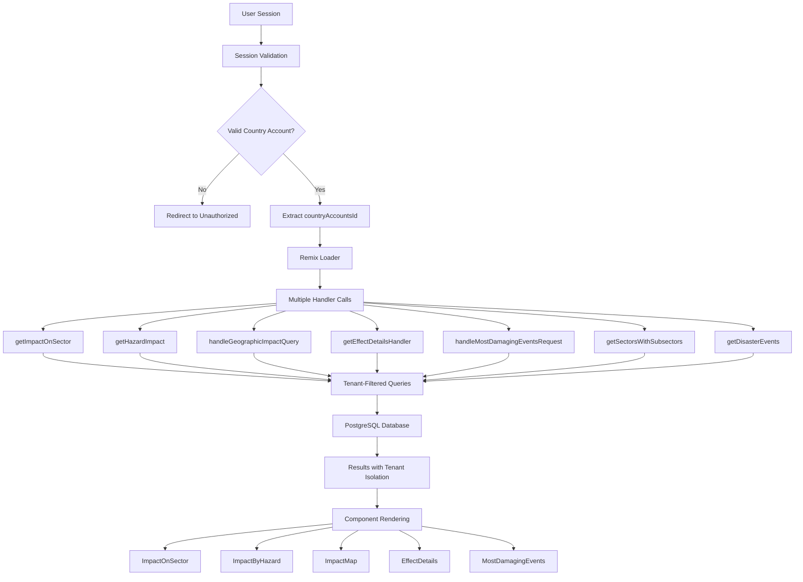
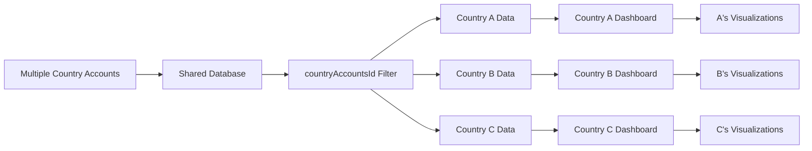
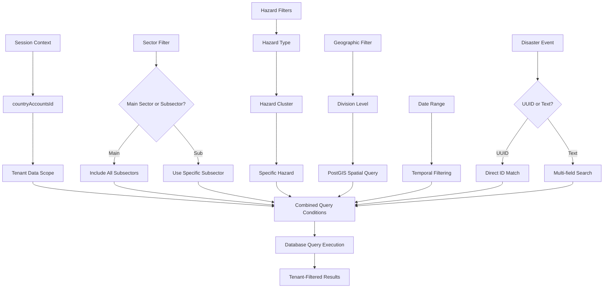
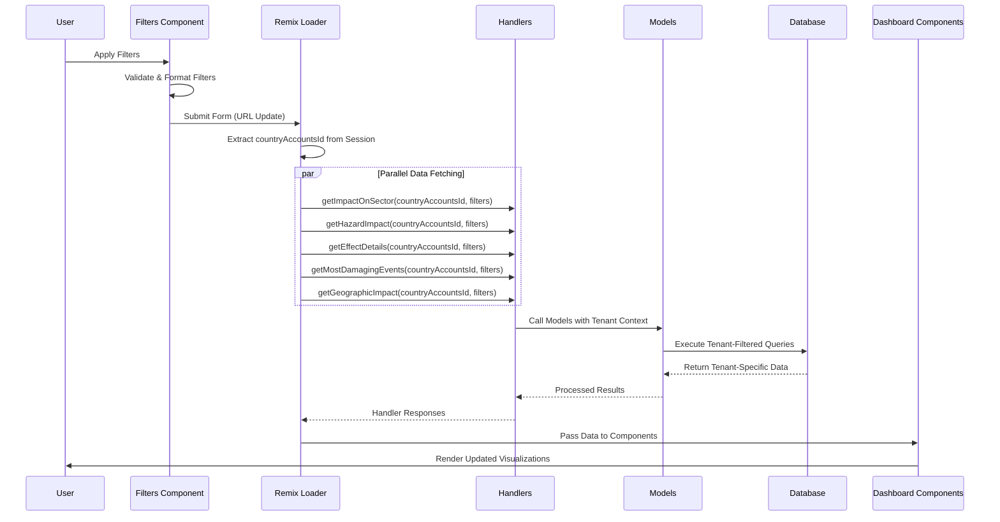

# Sectors Analytics Dashboard - Developer Guide

## Overview

This guide provides technical implementation details for the Sectors Analysis Dashboard in the **shared instance architecture**. The system supports multiple country accounts within a single deployment, requiring proper tenant isolation and authentication.

## Architectural Changes from Country Instance

### Key Differences
- **Multi-Tenant Architecture**: Single deployment serves multiple country accounts
- **Tenant Isolation**: All data queries include `countryAccountsId` for data separation
- **Session-Based Authentication**: Country account context retrieved from user session
- **Centralized Data Loading**: Remix loader handles all data fetching with tenant context

## Technical Requirements

### Common Requirements Across All Sections

All dashboard sections share the following base requirements:

1. **Authentication & Authorization**: 
   - User must be authenticated with valid session
   - User must have `ViewData` permission
   - Valid `countryAccountsId` must be available from session
2. **Tenant Context**: All queries must include proper tenant isolation
3. **Data Availability**: At least one disaster record must exist for the tenant
4. **Approval Status**: Only disaster records with `approvalStatus` set to `'published'` will be included
5. **Data Integrity**: Records must have valid relationships between tables within tenant boundary

## Section-Specific Implementation

### 1. Impact on Selected Sector

#### Data Retrieval Conditions
- **Primary Requirement**: Valid `sectorId` must be provided
- **Tenant Requirements**:
  - Valid `countryAccountsId` from session context
  - Sector must exist within the tenant's data scope
  - Disaster records must belong to the same tenant (`countryAccountsId`)

#### Code Implementation
```typescript
// Updated loader with tenant context
export const loader = authLoaderPublicOrWithPerm(
  "ViewData",
  async (loaderArgs: any) => {
    const { request } = loaderArgs;
    const countryAccountsId = await getCountryAccountsIdFromSession(request);

    // MANDATORY TENANT VALIDATION
    if (!countryAccountsId) {
      return redirect("/error/unauthorized?reason=content-not-published");
    }

    // All data fetching now includes tenant context
    const sectorHandlerResponse = await getImpactOnSector(
      countryAccountsId, // Tenant isolation
      subSectorId || sectorId || "",
      handlerFilters,
      currency
    );
    
    return { sectorImpactData, currency, settings };
  }
);
```

### 2. Impact by Hazard Type

#### Backend Model Implementation
```typescript
export async function fetchHazardImpactData(
  countryAccountsId: string, // Required tenant context
  filters: HazardImpactFilters
): Promise<HazardImpactResult> {
  // Base conditions now include tenant isolation
  let baseConditions: SQL[] = [
    sql`${disasterRecordsTable.approvalStatus} = 'published'`,
    sql`${disasterRecordsTable.countryAccountsId} = ${countryAccountsId}` // Tenant filter
  ];
  
  // All subsequent queries respect tenant boundary
  // ...existing logic with tenant context
}
```

### 3. Impact by Geographic Location

#### Geographic Queries with Tenant Isolation
```typescript
export async function getGeographicLevels(
  countryAccountId: string // Tenant context required
): Promise<GeographicLevel[]> {
  return dr.select({
    id: divisionTable.id,
    name: divisionTable.name,
    level: divisionTable.level ?? 1,
    parentId: divisionTable.parentId,
  })
  .from(divisionTable)
  .where(
    and(
      eq(divisionTable.level, 1),
      eq(divisionTable.countryAccountsId, countryAccountId) // Tenant isolation
    )
  );
}
```

### 4. Effect Details in Sector

#### Updated Effect Details Query
```typescript
export async function getEffectDetails(
  countryAccountsId: string, // Tenant context required
  filters: FilterParams
) {
  // Base conditions include tenant isolation
  let baseConditions: SQL[] = [
    sql`${disasterRecordsTable.approvalStatus} ILIKE 'published'`,
    eq(disasterRecordsTable.countryAccountsId, countryAccountsId), // Tenant filter
  ];
  
  // All data queries respect tenant boundary
  // ...existing logic with tenant isolation
}
```

### 5. Most Damaging Events

#### Updated Event Queries
```typescript
async function buildFilterConditions(
  countryAccountsId: string, // Tenant context required
  params: MostDamagingEventsParams
): Promise<{ conditions: SQL<unknown>[]; sectorIds?: string[] }> {
  let conditions: SQL[] = [
    eq(disasterRecordsTable.countryAccountsId, countryAccountsId), // Tenant isolation
    sql`${disasterRecordsTable.approvalStatus} = 'published'`
  ];
  
  // All filter conditions respect tenant boundary
  // ...existing logic with tenant context
}
```

## Multi-Tenant Data Access Patterns

### Session Management
```typescript
// All routes now require session-based tenant context
const countryAccountsId = await getCountryAccountsIdFromSession(request);
const settings = await getCountrySettingsFromSession(request);

// Currency is now tenant-specific
let currency = "USD";
if (settings && settings.currencyCode) {
  currency = settings.currencyCode;
}
```

### Handler Pattern
```typescript
export const handlerFunction = async (
  countryAccountsId: string, // Required first parameter
  filters: FilterType
) => {
  // Validate tenant context
  if (!countryAccountsId) {
    throw new Error("Invalid tenant context provided");
  }
  
  // Pass tenant context to model
  const data = await modelFunction(countryAccountsId, filters);
  return data;
};
```

### Model Pattern
```typescript
export const modelFunction = async (
  countryAccountsId: string,
  filters: FilterType
) => {
  const query = dr.select()
    .from(table)
    .where(
      and(
        eq(table.countryAccountsId, countryAccountsId), // Tenant filter
        // ...other conditions
      )
    );
  
  return await query;
};
```

## Data Security and Isolation

### Tenant Isolation Strategy
1. **Database Level**: All queries include `countryAccountsId` filter
2. **Handler Level**: Tenant context validation before processing
3. **Session Level**: Country account retrieved from authenticated session
4. **API Level**: No direct database access without tenant context

### Security Implementation
```typescript
// Example of proper tenant isolation in geographic queries
const divisions = await dr.select({
  id: divisionTable.id,
  name: divisionTable.name,
  geojson: divisionTable.geojson
})
.from(divisionTable)
.where(
  and(
    eq(divisionTable.level, 1),
    eq(divisionTable.countryAccountsId, countryAccountsId) // Mandatory tenant filter
  )
);
```

## Visual Architecture Diagrams

### Data Flow Diagrams

#### Shared Instance Data Flow Architecture


#### Tenant Isolation Data Flow


### Dashboard Section Mockups

#### Filter Panel Layout
```
┌─────────────────────────────────────────────────────────────────────────┐
│                          FILTERS PANEL                                  │
├─────────────────┬─────────────────┬─────────────────┬─────────────────┤
│ Sector *        │ Sub Sector      │ Hazard Type     │ Hazard Cluster  │
│ [Agriculture ▼] │ [Crops      ▼]  │ [Flood      ▼]  │ [Riverine   ▼]  │
├─────────────────┼─────────────────┼─────────────────┼─────────────────┤
│ Specific Hazard │ Geographic Level│ From Date       │ To Date         │
│ [Flash Flood ▼] │ [Province   ▼]  │ [2020-01-01  ]  │ [2024-12-31  ]  │
├─────────────────┴─────────────────┴─────────────────┴─────────────────┤
│ Disaster Event Search                                                  │
│ [🔍 Type to search by name, ID, GLIDE number...              ]         │
├─────────────────────────────────────────────────────────────────────────┤
│                                            [Clear] [Apply Filters]     │
└─────────────────────────────────────────────────────────────────────────┘
```

#### Impact on Sector Dashboard Layout
```
┌─────────────────────────────────────────────────────────────────────────┐
│                Impact in Agriculture Sector                            │
├─────────────────┬───────────────────────────────────────────────────────┤
│ Events Count    │                Events Timeline                       │
│                 │ ┌─────────────────────────────────────────────────┐   │
│      127        │ │    ▲                                           │   │
│   disasters     │ │   ▲│▲     ▲                                   │   │
│                 │ │  ▲ │ ▲   ▲ ▲                                  │   │
│                 │ │ ▲  │  ▲ ▲   ▲                                 │   │
│                 │ │▲   │   ▲     ▲                                │   │
│                 │ └─────────────────────────────────────────────────┘   │
│                 │  2020   2021   2022   2023   2024                    │
├─────────────────┼───────────────────────────────────────────────────────┤
│ Total Damages   │                 Damages Timeline                     │
│                 │ ┌─────────────────────────────────────────────────┐   │
│  $2.4B USD      │ │    ████                                        │   │
│                 │ │   ██  ██     ██                                │   │
│                 │ │  ██    ██   ██ ██                              │   │
│                 │ │ ██      ██ ██   ██                             │   │
│                 │ │██        ███     ██                            │   │
│                 │ └─────────────────────────────────────────────────┘   │
│                 │  2020   2021   2022   2023   2024                    │
├─────────────────┼───────────────────────────────────────────────────────┤
│ Total Losses    │                 Losses Timeline                      │
│                 │ ┌─────────────────────────────────────────────────┐   │
│  $1.8B USD      │ │      ████                                      │   │
│                 │ │     ██  ██     ██                              │   │
│                 │ │    ██    ██   ██ ██                            │   │
│                 │ │   ██      ██ ██   ██                           │   │
│                 │ │  ██        ███     ██                          │   │
│                 │ └─────────────────────────────────────────────────┘   │
│                 │  2020   2021   2022   2023   2024                    │
└─────────────────┴───────────────────────────────────────────────────────┘
```

#### Geographic Impact Map Layout
```
┌─────────────────────────────────────────────────────────────────────────┐
│         Impact in Agriculture Sector by Geographic Level               │
├─────────────────────────────────────────────────────────────────────────┤
│ [Total Damages in USD] [Total Losses in USD]                           │
├─────────────────────────────────────────────────────────────────────────┤
│                                                                         │
│  ┌─────────────────────────────────────────────────────────────────┐    │
│  │                    INTERACTIVE MAP                              │    │
│  │  ┌─────────┐  ┌─────────┐  ┌─────────┐  ┌─────────┐             │    │
│  │  │Province │  │Province │  │Province │  │Province │             │    │
│  │  │   A     │  │   B     │  │   C     │  │   D     │             │    │
│  │  │ $125M   │  │ $89M    │  │ $234M   │  │ $45M    │             │    │
│  │  └─────────┘  └─────────┘  └─────────┘  └─────────┘             │    │
│  │                                                                 │    │
│  │  Legend: □ No Data  □ $0-50M  ■ $50-100M  ■ $100M+             │    │
│  └─────────────────────────────────────────────────────────────────┘    │
│                                                                         │
└─────────────────────────────────────────────────────────────────────────┘
```

### Filter Relationship Visualization

#### Hierarchical Filter Dependencies


#### Filter Impact Matrix
| Filter Applied | ImpactOnSector | ImpactByHazard | ImpactMap | EffectDetails | MostDamagingEvents |
|----------------|----------------|----------------|-----------|---------------|-------------------|
| countryAccountsId | ✓ | ✓ | ✓ | ✓ | ✓ |
| sectorId (required) | ✓ | ✓ | ✓ | ✓ | ✓ |
| subSectorId | ✓ | ✓ | ✓ | ✓ | ✓ |
| hazardTypeId | ✓ | ✓ | ✓ | ✓ | ✓ |
| hazardClusterId | ✓ | ✓ | ✓ | ✓ | ✓ |
| specificHazardId | ✓ | ✓ | ✓ | ✓ | ✓ |
| geographicLevelId | ✓ | ✓ | ✓ | ✓ | ✓ |
| fromDate/toDate | ✓ | ✓ | ✓ | ✓ | ✓ |
| disasterEventId | ✓ | ✓ | ✓ | ✓ | ✓ |

#### Component State Flow


## Error Handling Patterns

### Tenant-Specific Errors
```typescript
// Standardized error handling
if (!countryAccountsId) {
  return {
    success: false,
    error: "Invalid tenant context provided",
    code: "INVALID_TENANT"
  };
}

// Geographic data validation
if (!divisionData || divisionData.length === 0) {
  return {
    success: false,
    divisions: [],
    values: {},
    error: "No divisions found for the given criteria within your country account"
  };
}
```

### Authentication Flow Implementation
```typescript
// Updated authentication check
if (!countryAccountsId) {
  return redirect("/error/unauthorized?reason=content-not-published");
}

// Tenant context validation in handlers
export async function getEffectDetailsHandler(
  countryAccountsId: string,
  params: FilterParams
) {
  if (!countryAccountsId) {
    throw new EffectDetailsError(
      'Invalid tenant context provided', 
      'INVALID_TENANT'
    );
  }
  // ...existing logic
}
```

## Performance Optimization

### Tenant-Optimized Queries
```typescript
// Efficient tenant filtering
const query = dr.select()
  .from(disasterRecordsTable)
  .where(
    and(
      eq(disasterRecordsTable.countryAccountsId, countryAccountsId), // Applied first
      eq(disasterRecordsTable.approvalStatus, 'published'),
      // ...other conditions
    )
  );
```

### Caching Strategy
```typescript
// Tenant-specific result caching
const cacheKey = `${countryAccountsId}:${JSON.stringify(filters)}`;
const cached = resultsCache.get(cacheKey);
if (cached) {
  return cached;
}
```

## Testing Guidelines

### Unit Testing with Tenant Context
```typescript
describe('Sectors Analytics Handler', () => {
  it('should reject requests without tenant context', async () => {
    await expect(
      getImpactOnSector('', sectorId, filters)
    ).rejects.toThrow('Invalid tenant context provided');
  });

  it('should filter results by tenant', async () => {
    const result = await getImpactOnSector(tenantA, sectorId, filters);
    expect(result.data).toHaveProperty('eventCount');
    // Verify no data from other tenants
  });
});
```

### Integration Testing
```typescript
describe('Multi-Tenant Dashboard', () => {
  it('should isolate data between tenants', async () => {
    const tenantAResult = await request(app)
      .get('/analytics/sectors')
      .set('Session-Country-Account', tenantA);
    
    const tenantBResult = await request(app)
      .get('/analytics/sectors')
      .set('Session-Country-Account', tenantB);
    
    expect(tenantAResult.body).not.toEqual(tenantBResult.body);
  });
});
```

## Database Schema Requirements

### Required Indexes for Performance
```sql
-- Tenant isolation indexes
CREATE INDEX idx_disaster_records_country_accounts_id 
ON disaster_records(country_accounts_id, approval_status);

CREATE INDEX idx_division_country_accounts_id_level 
ON division(country_accounts_id, level);

CREATE INDEX idx_sector_disaster_records_relation_tenant 
ON sector_disaster_records_relation(disaster_record_id, sector_id);
```

### Data Migration Notes
```sql
-- Add tenant context to existing tables
ALTER TABLE disaster_records ADD COLUMN country_accounts_id UUID;
ALTER TABLE division ADD COLUMN country_accounts_id UUID;

-- Update existing data with tenant context
UPDATE disaster_records SET country_accounts_id = 'default-tenant-uuid';
UPDATE division SET country_accounts_id = 'default-tenant-uuid';
```

## Security Audit Checklist

- [ ] All database queries include `countryAccountsId` filter
- [ ] Session validation occurs before data access
- [ ] Handler functions validate tenant context
- [ ] No direct database access without tenant isolation
- [ ] Error messages don't leak cross-tenant information
- [ ] Logging includes tenant context for audit trails
- [ ] API endpoints require proper authentication
- [ ] Geographic queries respect tenant boundaries

## Technical Glossary

| Term | Definition |
|------|------------|
| Country Account | The tenant identifier that isolates data for each country/organization |
| Tenant Context | The `countryAccountsId` that ensures data isolation |
| Session Management | Authentication system that maintains country account context |
| Tenant Isolation | Database-level filtering that prevents cross-account data access |
| Shared Instance | Single deployment serving multiple country accounts |
| Handler Pattern | Business logic layer that processes tenant context |
| Model Pattern | Data access layer with mandatory tenant filtering |